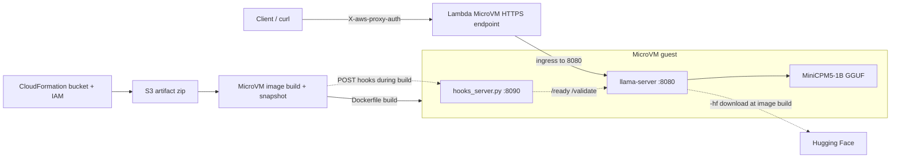

# llama.cpp on AWS Lambda MicroVMs

Runs [llama.cpp](https://github.com/ggerganov/llama.cpp) `llama-server` inside an AWS Lambda MicroVM with the Hugging Face model `openbmb/MiniCPM5-1B-GGUF:Q4_K_M`.

The MicroVM image is sized at the service maximum baseline (**8 GiB / 4 vCPU**), which can peak at **32 GiB / 16 vCPU**. Lambda MicroVMs are **ARM64-only** (Graviton); x86 binaries from a local `build-x64-*` tree cannot be reused.

<video controls src="https://github.com/user-attachments/assets/345a6f0e-6e64-4140-b79a-673dbfc978a9"></video>

## Architecture



## Layout

| Path | Purpose |
|------|---------|
| `Dockerfile` | Ubuntu 24.04 app image; downloads official llama.cpp Ubuntu arm64 release |
| `entrypoint.sh` | Starts hooks server + `llama-server` (`-hf`, `-t 16`, `-c 2048`) |
| `hooks_server.py` | Lifecycle hooks on port **8090** (`POST /aws/lambda-microvms/runtime/v1/*`) |
| `template.yaml` | CloudFormation: S3 artifact bucket, build/execution IAM roles, optional `AWS::Lambda::MicrovmImage` |
| `scripts/package.sh` | Zip Dockerfile + entrypoint + hooks for S3 |
| `scripts/deploy-and-test.sh` | Full path: infra → package → create image → run → chat → terminate |
| `scripts/run-and-test.sh` | Run + chat against an existing image (skip rebuild) |

`llama-server` listens on **8080** (default MicroVM ingress). Hooks listen on **8090**.

## Prerequisites

- AWS account with Lambda MicroVMs available in `$AWS_REGION`
- IAM credentials that can manage CloudFormation, S3, IAM roles, and `lambda-microvms` APIs
- AWS CLI **v2 with `lambda-microvms`** (the deploy script upgrades the CLI if needed)
- `curl`, `jq`, `zip`, `python3`

```bash
export AWS_REGION="${AWS_REGION:-us-west-2}"
export PATH="${HOME}/.local/bin:${PATH}"   # if CLI was installed to ~/.local
aws lambda-microvms help >/dev/null && echo ok
```

## Build (package artifact)

The MicroVM service builds the container from a zip that must contain `Dockerfile` at the root:

```bash
cd microvm-llama
./scripts/package.sh
# → writes ./llama-microvm.zip
```

What the Dockerfile does at image-build time:

1. Install runtime deps (`python3`, `libgomp`, `curl`, …)
2. Download `llama-b9977-bin-ubuntu-arm64.tar.gz` from GitHub Releases
3. Start `llama-server -hf openbmb/MiniCPM5-1B-GGUF:Q4_K_M -t 16 -c 2048`
4. Wait until `/health` is OK, then answer the `/ready` hook so Lambda snapshots a warm server

## Deploy

### One-shot (recommended)

Creates the CloudFormation stack (bucket + roles), uploads the zip, creates the MicroVM image via CLI (long builds exceed CloudFormation’s stabilize window), runs a MicroVM, sends a test prompt, then terminates:

```bash
export AWS_REGION="${AWS_REGION:-us-west-2}"
cd microvm-llama
./scripts/deploy-and-test.sh
```

Defaults:

| Variable | Default |
|----------|---------|
| `AWS_REGION` | `us-west-2` (if unset) |
| `STACK_NAME` | `llama-microvm` |
| `IMAGE_NAME` | `llama-minicpm-server` |

### Manual steps

```bash
export AWS_REGION="${AWS_REGION:-us-west-2}"

# 1) Infra only (bucket + IAM)
aws cloudformation deploy \
  --region "$AWS_REGION" \
  --stack-name llama-microvm \
  --template-file template.yaml \
  --capabilities CAPABILITY_NAMED_IAM \
  --parameter-overrides DeployImage=false

BUCKET=$(aws cloudformation describe-stacks --region "$AWS_REGION" --stack-name llama-microvm \
  --query "Stacks[0].Outputs[?OutputKey=='ArtifactBucketName'].OutputValue" --output text)
BUILD_ROLE=$(aws cloudformation describe-stacks --region "$AWS_REGION" --stack-name llama-microvm \
  --query "Stacks[0].Outputs[?OutputKey=='BuildRoleArn'].OutputValue" --output text)

# 2) Package + upload
./scripts/package.sh
aws s3 cp llama-microvm.zip "s3://${BUCKET}/llama-microvm.zip" --region "$AWS_REGION"

# 3) Create image (poll until state=CREATED)
# See scripts/deploy-and-test.sh for the full create-microvm-image flags
# (8 GiB memory, ARM_64, INTERNET_EGRESS, ready/validate hooks on 8090).
```

Optional: set `DeployImage=true` on a second CloudFormation deploy to manage `AWS::Lambda::MicrovmImage` in the template. Prefer the CLI path for first builds; CFN can fail with `NotStabilized` while llama downloads/loads the model.

## Test / run inference

### Automated

```bash
export AWS_REGION="${AWS_REGION:-us-west-2}"
# Against an already-built image
./scripts/run-and-test.sh
```

### Manual

```bash
export AWS_REGION="${AWS_REGION:-us-west-2}"
ACCOUNT=$(aws sts get-caller-identity --query Account --output text)
IMAGE_ARN="arn:aws:lambda:${AWS_REGION}:${ACCOUNT}:microvm-image:llama-minicpm-server"
EXEC_ROLE=$(aws cloudformation describe-stacks --region "$AWS_REGION" --stack-name llama-microvm \
  --query "Stacks[0].Outputs[?OutputKey=='MicroVmExecutionRoleArn'].OutputValue" --output text)

# Start
aws lambda-microvms run-microvm \
  --region "$AWS_REGION" \
  --image-identifier "$IMAGE_ARN" \
  --execution-role-arn "$EXEC_ROLE" \
  --ingress-network-connectors "arn:aws:lambda:${AWS_REGION}:aws:network-connector:aws-network-connector:ALL_INGRESS" \
  --egress-network-connectors "arn:aws:lambda:${AWS_REGION}:aws:network-connector:aws-network-connector:INTERNET_EGRESS" \
  --idle-policy '{"autoResumeEnabled":true,"maxIdleDurationSeconds":900,"suspendedDurationSeconds":300}' \
  --maximum-duration-in-seconds 3600

# Wait until state=RUNNING, note microvmId + endpoint, then:
TOKEN=$(aws lambda-microvms create-microvm-auth-token \
  --region "$AWS_REGION" \
  --microvm-identifier "$MICROVM_ID" \
  --expiration-in-minutes 60 \
  --allowed-ports '[{"port":8080}]' \
  --query 'authToken' --output text)

curl -sS "https://${ENDPOINT}/v1/chat/completions" \
  -H "X-aws-proxy-auth: ${TOKEN}" \
  -H "Content-Type: application/json" \
  -d '{
    "model": "openbmb/MiniCPM5-1B-GGUF:Q4_K_M",
    "messages": [{"role": "user", "content": "How can I loose weight ?"}],
    "max_tokens": 512
  }' | jq .

# Stop (avoids ongoing compute charges)
aws lambda-microvms terminate-microvm \
  --region "$AWS_REGION" \
  --microvm-identifier "$MICROVM_ID"
```

**Auth:** every request needs `X-aws-proxy-auth` with a token from `create-microvm-auth-token`.

**Response shape:** MiniCPM may put text in `choices[0].message.reasoning_content` rather than `content`. The test scripts accept either field.

## Cleanup

```bash
export AWS_REGION="${AWS_REGION:-us-west-2}"
ACCOUNT=$(aws sts get-caller-identity --query Account --output text)

# Terminate any running MicroVMs first
aws lambda-microvms list-microvms --region "$AWS_REGION"

# Delete the MicroVM image (optional)
aws lambda-microvms delete-microvm-image \
  --region "$AWS_REGION" \
  --image-identifier "arn:aws:lambda:${AWS_REGION}:${ACCOUNT}:microvm-image:llama-minicpm-server"

# Delete the CloudFormation stack (artifact bucket is Retain by default)
aws cloudformation delete-stack --region "$AWS_REGION" --stack-name llama-microvm
```
